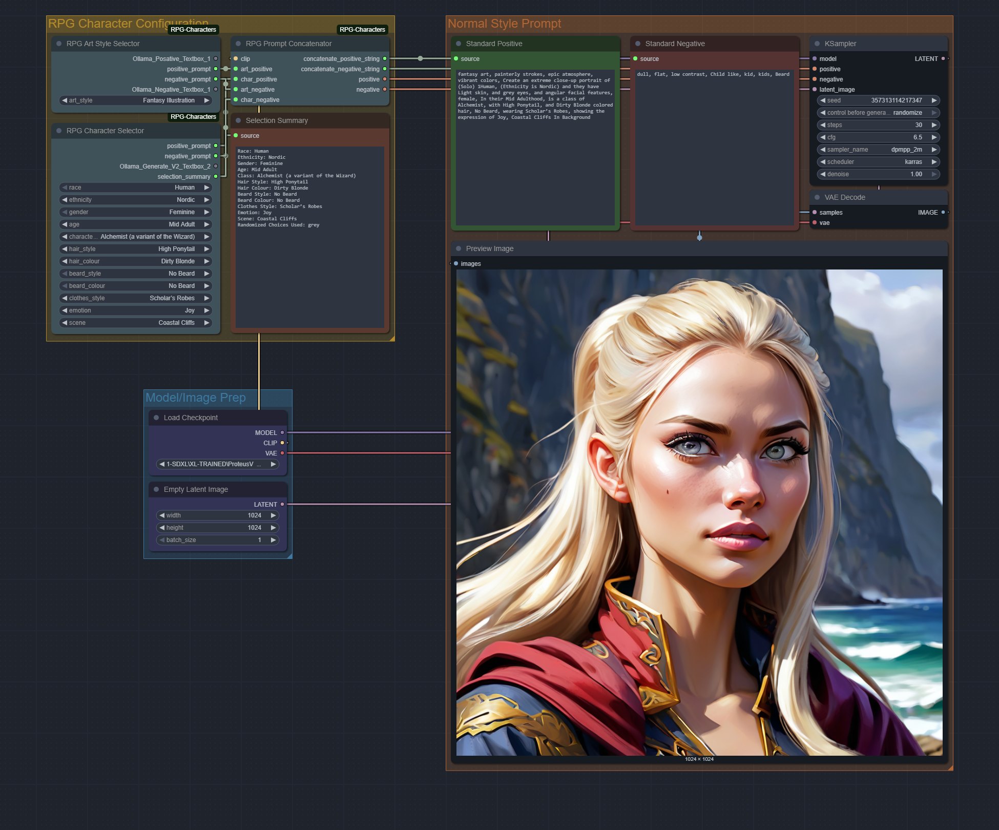
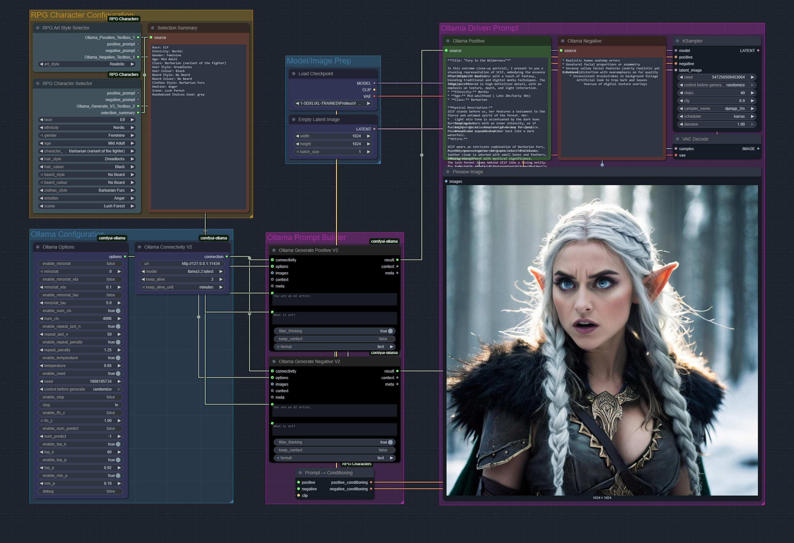
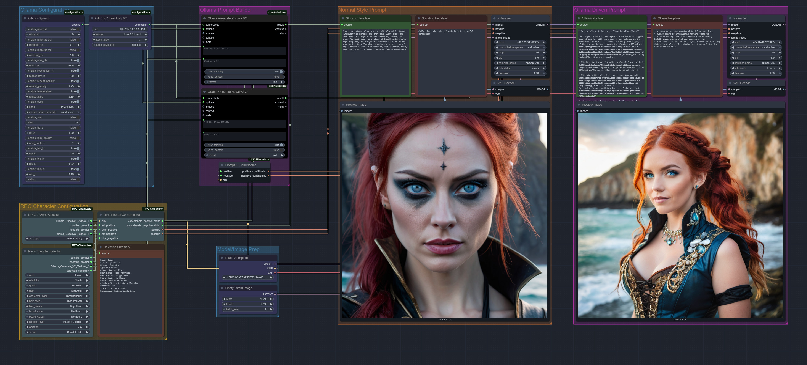
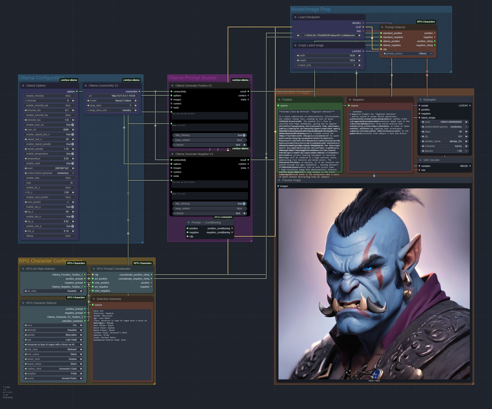
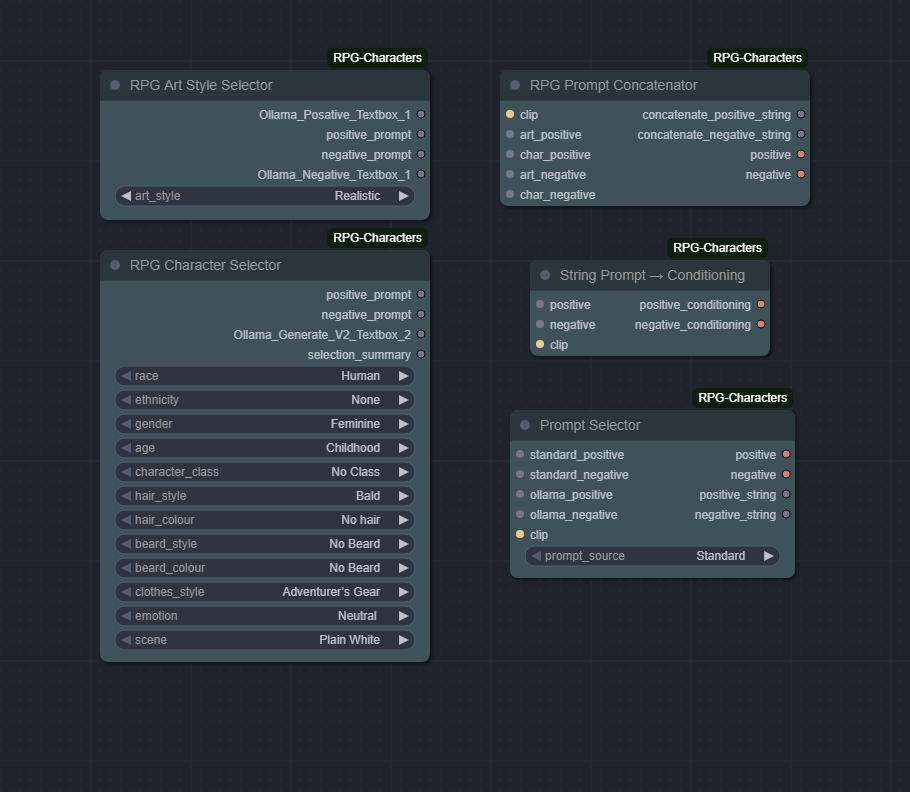

# ComfyUI-RPG-Characters

A custom node for [ComfyUI](https://github.com/comfyanonymous/ComfyUI) that generates stylized prompts for RPG characters. This node outputs both **standard prompt formats** and enhanced **Ollama-style descriptive prompts** ideal for **extreme close-up portraits**.

✅ Compatible with **Stable Diffusion**, **SDXL**, **Flux**, and any model that uses structured prompts.

---

## ✨ Features

- 🎨 Choose from a variety of art styles:
  - Anime Style
  - Dark Fantasy
  - Realistic
  - Fantasy Illustration
  - Digital Painting
  - Pixar Animation

- 🧠 Generates:
  - Standard Positive & Negative Prompts (for SD, SDXL, Flux)
  - Ollama-style Descriptive Prompt (text-to-text guidance)
  - Ollama-style Negative Prompt Instruction

- 📸 Designed for **1024x1024 extreme close-up portraits**
- 📄 Fully structured to support character features:
  - Race, Ethnicity, Gender, Age, Class
  - Hair & Beard Styles and Colours
  - Clothing Style, Emotion, and Scene

---

## 🧱 Node Outputs

| Output Name                  | Description |
|-----------------------------|-------------|
| `positive_prompt`            | Standard positive tag string |
| `negative_prompt`            | Standard negative tag string |
| `Ollama_Posative_Textbox_1` | Detailed descriptive prompt for LLMs or advanced generators |
| `Ollama_Negative_Textbox_1` | Instructional template to guide LLMs on what to exclude |
| `Ollama_Posative_Textbox_2` | Extra Prompt Food for LLMs or advanced generators that have a second Text Input|

---

## 📂 Example Files

All examples are in the `Examples/` folder of this repository.

### 🧠 Standard Prompt Examples

**Node Setup:**  
  
**Workflow File:**  
[`RPG_Nodes_Normal.json`](Examples/RPG_Nodes_Normal.json)

---

### 🧠 Ollama-Driven Prompt Examples

**Node Setup:**  
  
**Workflow File:**  
[`RPG_Nodes_Ollama.json`](Examples/RPG_Nodes_Ollama.json)

---

### ⚔️ Comparison: Standard vs Ollama

**Side-by-Side Visual:**  
  
**Workflow File:**  
[`RPG_Nodes_Normal_Vs_Ollama.json`](Examples/RPG_Nodes_Normal_Vs_Ollama.json)

---

### 🔁 Prompt Switcher Example

**Prompt Switch Node Example:**  
  
**Workflow File:**  
[`RPG_Nodes_Normal_and_Ollama_With_Switch.json`](Examples/RPG_Nodes_Normal_and_Ollama_With_Switch.json)

---

### 🧩 Full Node Collection

A visual reference of the full node layout.  


---

## 📦 Installation

Clone this repo into your ComfyUI `custom_nodes` folder:

```bash
git clone https://github.com/lord-lethris/ComfyUI-RPG-Characters.git
```

Restart ComfyUI after installation.

---

## 🛠️ Usage

1. Add the **RPG Art Style Selector** node from the "RPG" category.  
2. Select an Art Style from the dropdown.  
3. Connect outputs as needed:  
   - `positive_prompt` / `negative_prompt` → your SD/SDXL/Flux prompt node  
   - `Ollama_Posative_Textbox_1` / `Ollama_Negative_Textbox_1` → LLM or prompt analysis/feedback tools

---

## ⚠️ Optional Ollama Support Requirements

To use the **Ollama-driven prompt generation** features in this node, you need to:

- Install the [**Ollama server**](https://ollama.com/) on your desired host.
  - Download for [macOS](https://ollama.com/download/mac) or [Windows](https://ollama.com/download/windows)
- Install the [**ComfyUI-Ollama node**](https://github.com/stavsap/comfyui-ollama) by Stav Sapir

> Without these installed and running, the Ollama prompt outputs in this node will not function.

---

Credit for the [ComfyUI-Ollama node](https://github.com/stavsap/comfyui-ollama) goes to Stav Sapir ([stavsap](https://github.com/stavsap)).

---

## 🔮 Future Plans

- Dynamic LLM integration for auto-generating character prompts  
- Additional art styles (e.g., pixel art, steampunk, noir)  
- Visual dropdowns for selecting features (e.g., races, classes, emotions)

---

## 🐾 Made by Lord Lethris

Featuring Belle the cat, who disapproves of bad prompts. 🐱
